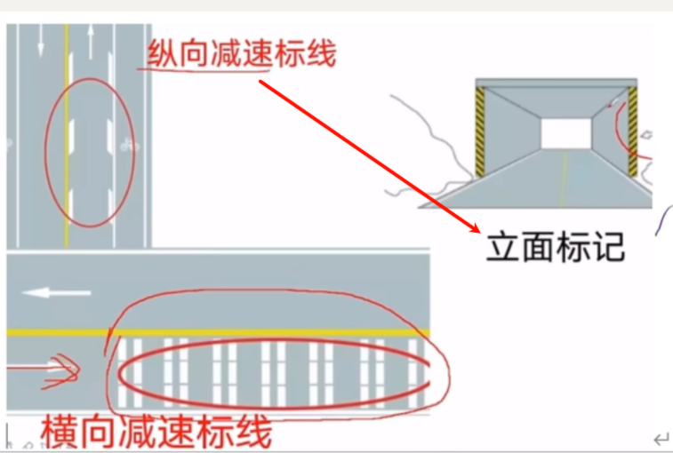
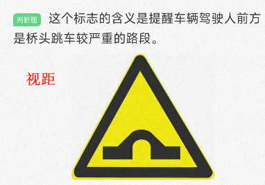
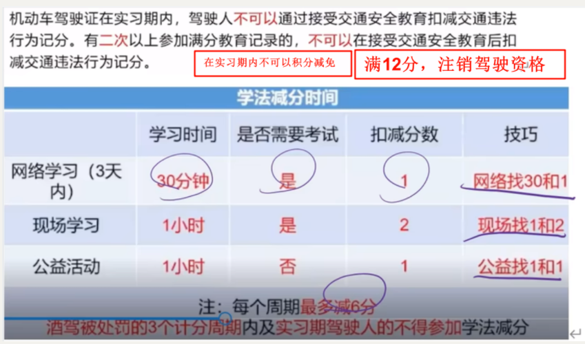

# 驾照科目一过

## 一堆字

```markdown
# 驾驶证被注销情形
- 假1骗3(不正当)(撤销)
- 毒3醉5逃罪终生
# 非正常道路灯光使用
- 交替使用远近光灯
# 交替灯光选择
- 有交替选交替
- 没有交替选近光
# 夜间视线较差路口转弯时关闭远光灯距离
- 正确答案: 30-100米
- 错误答案: 50-100米
# 驾驶证相关规定
- 有效期: 3年
- 申请时间: 有效期满前90天
- 实习期: 12个月
- 大型客车申请年龄: 22岁
- 换证地点: 登记地(期满可在居住地)
- 被注销/吊销: 正确
- 不被注销/吊销: 错误
```


## 车装置


## 灰





## 黄




注意出生

注意野怪

## 蓝


我们先行

可以直行和左转

## 绿


## 红


## 未知色


## 审验


每个记分周期结束都要在30日内进行审验，大中型客货车本记分周期没有扣分，则可以免于审验。以外的结束30日都就要审验

记分周期内累积记分满12分的，参加7日学习

饮酒受到过处罚的，3个记分周期内，不得扣减记分

## 一堆字


## 罚款

```markdown
# 机动车驾驶人违法代办处罚
- 罚款:
  - 上限:五万元
  - 下限:经济利益3倍以下
- 附加处罚:依法对原违法行为处罚
```


## 扣分加分

```markdown
# 驾驶违规扣分速记
## 1-3-6-9-12 规律
1分: 普通灯, 违禁停车, 不按规检验/掉头/倒车
3分: 普通逆行, 高速不按车道, 借道穿插, 不让, 不按规号牌, 警告标志
6分: 高速占应急, 无/轻逃, 扣留驾驶
9分: 高速违停, 挡车牌, 无资格校车
12分: 高速逆行, 重逃逸, 伪造变造
## 超速记忆口诀
369: 高速+, 超50+, 其他+20 (2-5-1)
## 超员/载记忆口诀
超员3612: 校车大巴612 (2-5-1除大巴2)
超载136 (3-5)
## 信号灯特殊
信号灯: 6分
# 驾驶证规定
## 车型年龄
- C5:残疾人专用小型自动挡载客车
- C6:轻型牵引挂车,<60岁1年+增驾
- 大货2年可增驾中客
## 记分制度
- 满12分:
  小车:现场2天,共7天
  大中客货/公交/重牵:30天
## 考试科目
- 24-36分:科目一
- 36分+:科目一二三
```


超速369 高速+ 超50+ 其他车+ 超20也算     2-5-1

超员3612，校车大巴612                                2-5-1 除了大巴2

超载136                                                               3-5


不按规定检验普通车1分，不按规定掉头倒车1分，

普通逆行3分，高速不按车道行驶3分，借道穿插3分，不让3分

高速占应急6分 

高速违法停车9分，

高速逆行12分


普通灯 1分，信号灯6分


违法禁令1分，(比如停车)，警告标志3分


不按规定号牌3分，挡车牌9分


无或轻逃6分，轻以上逃12分


扣留驾驶6分

没资格驾驶校车9分

谋取利益，伪造变造12分




​                                                                                                                                                                                                                                                                                                                                                                                                                                                                                                                                   


## 有涉及到时间


在道路上追逐竞驶，视情况，处拘役并处罚金

考试过程中有贿赂、舞弊行为的，3年

中型客车、大型货车年满20周岁可以申请，而大型客车、重型牵引挂车需年满22岁，初次申领只能申领大型货车


饮酒后5年,被吊销的,不得申请机动车驾驶

未取得驾驶证开车发生事故，10年不能申请驾驶证

逃逸，构成犯罪的，终身


驾驶人有追逐竞驶。超员、超速等违法行为，会被吊销驾驶证，5年不得再次申领。

## 坑


# 科目四错题

```markdown
# 申请增加轻型牵引挂车准驾车型的要求
取得小型汽车、小型自动挡汽车驾驶证1年
# 机动车驾驶人在实习期内，可以通过接受交通安全教育扣减交通违法行为记分。
# 构成交通肇事罪的行为
- 正确答案: 酒后、吸食毒品后驾驶机动车辆的
# 机动车驾驶人一个记分周期内累积最高扣减分值
- 正确答案: 6分
- 速记: 参加满分学习,一年内最高减6分
# 道路上车辆发生故障、事故停车后,不按规定设置警告标志
- 正确答案: 错误
- 扣分: 3分
- 速记: 故障+不按规定设置警告标志,扣3分
# 小型汽车驾驶证类型
C1是最常见的私家车驾驶证类型，适用于普通轿车、SUV等小型汽车
其他类型:
C2: 自动挡小型汽车
C3: 低速载货汽车
C4: 三轮汽车
# 机动车驾驶人考试作弊处罚
- 正确答案: 处三年以上七年以下有期徒刑
# C6表示的准驾车型
- 正确答案: 轻型牵引挂车
- 速记: C6就是拖挂型房车=轻型牵引挂车
# 其他车辆最低驾驶年龄
- 正确答案: 22周岁
# 大风天行车注意事项
- 注意车辆的横向移动
- 尽量避免制动
- 关紧车窗
- 不超车
# 驾驶机动车在距离隧道前多少米内不得停车
- 正确答案: 50米 一般都是50米
# 冰雪路面上减速或停车如何降低车速
- 正确答案: 充分利用发动机的牵制作用
- 原因: 避免车轮打滑,保持稳定性
# 冰雪路面制动时车辆偏离方向的正确做法
- 正确答案: 停止踩刹车
- 原因: 避免车轮抱死,保持转向能力
# 大雾天行驶的正确做法
- 正确答案: 不可以紧急制动刹车
- 原因: 会造成后面的车辆追尾
# 救火时是否要脱去化纤服装
- 正确答案: 错误
- 原因: 化纤易燃,融化后紧贴皮肤,导致烧伤更严重
# 高速公路行车紧急情况避险处理原则
- 正确答案: 先避人后避物
- 原因: 人命优先,保护生命安全是首要任务
# 泥泞路段行车如何控制速度匀速通过
- 正确答案: 用加速踏板
- 原因: 保持稳定速度,避免车轮打滑或陷入泥泞
# 驾驶车辆驶入铁路道口后的正确做法
- 正确答案: 不能变换挡位
- 原因: 变换挡位可能导致熄火,造成危险
# 上坡路段停车如何使用行车制动
- 正确答案: 比在平路时推迟
- 原因: 上坡时车辆有向后滑动趋势,需要更长时间制动
# 只有1条机动车道的城市道路行驶时，最高车速不能超过每小时50公里，公路为每小时70公里
# 辅路车让主路车先行的原因
- 正确答案: 主路车流量大、速度快
- 原因: 保证主路交通流畅,减少事故风险
# 准驾车型为小型汽车可驾驶的车辆
- 正确答案: 低速载货汽车
- 原因: 小型汽车驾驶证可驾驶低速载货汽车,其他选项如中型客车、三轮摩托车和轮式自行机械均不在小型汽车驾驶证的准驾范围内
# 黑色速度是最高速度，白色速度是最低速度，黄色速度是最高速度
# 驾驶小型载客汽车在高速公路行驶的最低车速
- 问题: 驾驶小型载客汽车在高速公路行驶的最低车速为多少?
- 正确答案: 60公里/小时
- 原因: 题目给出的90公里/小时是错误的,实际规定为60公里/小时
# 无骨端外露骨折伤员肢体固定
- 正确答案: 要超过伤口上下关节
- 原因: 防止骨折端移位和血管神经损伤
- 速记: 上下关节，直接选
# 泥泞路段行车容易出现的现象
- 正确答案: 车轮侧滑
- 原因: 泥泞路面行驶阻力小易滑
- 速记: 泥泞选滑
# 正确使用灭火器的方法
- 正确答案: 灭火器瞄准火源
- 原因: 直接对准火源才能有效灭火
- 速记: 瞄准火源
# 泥泞路段驱动车轮空转打滑时的处理方法
- 正确答案: 在驱动轮下铺垫砂石
- 原因: 增加轮胎与地面的摩擦力,防止空转
- 速记: 驱动轮下铺砂石
# 出车前检查刮水器时的状态
- 正确答案: 不应在干燥状态下进行
- 原因: 应在有水的情况下检查,否则无法判断刮水器是否有效贴合
- 速记: 湿润检查刮水器
# 动脉出血的压迫止血部位
- 正确答案: 近心端
- 原因: 压迫近心端可降低心脏对血液的传递,减少出血
- 速记: 近心端动脉
# 夜间会车使用近光灯的距离
- 正确答案: 150米以！！外！！
- 原因: 避免对向来车驾驶人眩目
- 速记: 150米以外
# 能见度小于50米时的驾驶规定 （跟车50米）
- 开启灯光: 雾灯、近光灯、示廓灯、前后位灯、危险警报灯
- 限速: 不超过20公里/小时
- 行驶要求: 从最近出口驶离高速公路
- 速记: 距离不足不选,其余全选
# 下坡路段驾驶注意事项
- 正确答案: 避免超车
- 原因: 下坡车辆易加速,超车危险性增加
- 速记: 下坡路段+字数最长的两个
# 哪种情形会被扣留车辆
- 正确答案: 未放置检验合格标志
- 原因: 未放置检验合格标志属违法行为,可被扣留车辆
# 构成交通肇事罪的行为
- 正确答案: 严重超载驾驶的
- 原因: 
  - 交通肇事致一人以上重伤或死亡
  - 负事故全部或主要责任
  - 严重超载属于加重情节
# 驾驶机动车跨越双实线行驶属于什么行为?
- 正确答案: 违法行为
- 原因: 双实线表示禁止跨越,跨越属违法
# ABS系统在冰雪路面上的效果
- 问题: 装有ABS系统的机动车在冰雪路面上会最大限度缩短制动距离
- 正确答案: 错误
- 原因:
  - ABS可防止车轮抱死,但不能缩短冰雪路面制动距离
  - ABS通过快速点刹防止车轮抱死,避免侧滑和翻车
# 未按规定办理变更登记的处罚
- 处罚对象: 改变车身颜色、更换发动机、车身或者车架未按规定办理变更登记的
- 处罚方式: 公安机关交通管理部门处警告或200元以下罚款
# 无中心线城市道路最高行驶速度
- 正确答案: 每小时30公里
- 公路限速: 每小时40公里
- 单向机动车道限速:
  - 城市道路: 每小时50公里
  - 公路: 每小时70公里
# 机动车在没划分车道的道路行驶规定
- 正确答案: 在道路中间通行
- 原因: 确保安全距离,避免与路边行人、非机动车发生碰撞
# 脊柱骨折伤员处理方法
- 正确答案: 不可用软担架运送
- 原因: 软担架无法固定脊柱,可能造成二次伤害
- 正确处理: 使用硬担架固定脊柱
- 速记: 骨折,三角巾固定
# 路右侧白色矩形虚线框内停车规定
- 正确答案: 允许短时停车
- 错误说法: 允许长时间停车
- 原因: 虚线表示短时停车,实线表示长时停车
- 速记: 虚线短停,实线长停
# 驾驶人正确的应急驾驶姿势
- 正确答案:
  - 迅速躲离转向盘
  - 往副驾驶座位躲避
  - 迅速将两腿抬起
- 错误做法: 两腿蹬直
- 原因: 躲避正前方冲击,减少伤害
- 速记: 躲离盘、往副驾、抬腿
# 进环岛是否需要开转向灯
- 正确答案: 需要开转向灯
- 原因: 
  - 直行信号为红色时不可直接进入左转弯待转区
  - 直行绿灯且左转红灯时可进入"左转待转区"
- 速记: 等放行信号
# 下坡路段驾驶注意事项
- 避免超车
- 不可突然拉紧驻车制动
- 原因: 突然拉紧手刹会造成翻车
- 速记: 下坡越级挂挡
# 帮助脱掉燃烧的衣服的正确方法
- 正确答案: 向身上喷冷水灭火
- 原因: 最安全,不会加重伤情或造成二次伤害
- 速记: 燃烧伤员,选冷水
# 转弯让直行,右转让左转，都直行让右不让左
# 高速公路各车道最低时速规定
- 最左侧: 110-120公里/小时
- 中间: 90-110公里/小时
- 最右侧: 不低于60公里/小时
- 最高限速: 不得超过120公里/小时
# 车速较高情况下遇到紧急情况的正确处理方法
- 正确答案: 先稳住方向,再采取制动措施减速
- 错误做法: 突然动方向
- 原因: 突然动方向容易引起翻车
- 速记: 减少损坏
# 超车时不需要采取的措施
- 正确答案: 长时间鸣喇叭
- 其他正确措施:
  - 提前开启左转向灯
  - 变换使用远、近光灯
  - 鸣喇叭
  - 降低速度
  - 靠右让路
  - 从左侧超越
  - 与被超车辆拉开安全距离
  - 开启右转向灯驶回原车道
# 对晕倒病人的正确处理顺序
- 正确答案: 错误
- 原因: 应先开放气道,再采取仰卧位
- 速记: 先检查呼吸
# 夜间会车时开启远光灯的目的
- 正确答案: 便于双方观察前方情况
- 原因: 夜间视线受限,需借助灯光了解周围情况
- 速记: 观察前方
# 汽车上坡行驶时的制动操作
- 正确答案: 选择推迟
- 原因: 坡度阻力使车速下降,制动距离缩短
- 速记: 上坡,选推迟
# 前方堵车时进入交叉路口的正确做法
- 正确答案: 停车等待
- 原因: 前方堵车时进入交叉路口只能更堵
- 速记: 停车等待
# 大风天不超车，其余全选
# 能见度小于50米时的驾驶规定#
- 开启灯光:
  - 雾灯
  - 近光灯
  - 示廓灯
  - 前后位灯
  - 危险警报灯
- 限速: 不超过20公里/小时
- 行驶要求: 从最近出口驶离高速公路
# 车辆侧滑时的处理方法 
- 不可连续轻踩轻放刹车、用力踩刹车
- 应该停止踩刹车
# 下坡路段驾驶注意事项 避免超车
- 选两个字数最长的
# 上下坡路会车规则
- 正确答案: 下坡车让上坡车
- 原因: 上坡车动力不足,不易重新起步
- 速记: 上坡车先行
# 客车违规行为
- 客车超员
- 超速行驶
原因:
- 中型客车核载19人，陶某载客33人
- 高速公路大型客车限速110公里/小时，陶某超速
# 进环岛不用开转向灯
# 轮胎气压不足或两侧不均匀的影响
- 制动效果时差
- 操纵失控
- 转向困难或沉重
- 降低轮胎使用寿命
- 容易爆胎
- 增大油耗
- 载重量大时情况更严重
- 速记: 不一致，全选
# 左转弯待转区使用规则
- 直行绿灯亮时，左转弯灯红色:
  - 允许左转车辆进入待转区等候
  - 等左转信号灯变绿再通过路口
- 直行和左转信号灯都红色:
  - 所有车辆停止线等待
- 速记: 等放行信号
# 驾驶证被扣押、扣留、暂扣期间能否申请补发
- 正确答案: 不得申请补发
- 原因: 证件被执法部门暂时收回,无法申请补发
- 速记: 证件被扣,补发不可
# 违反交通运输管理法规的处罚
- 发生重大事故,致人重伤、死亡或财产重大损失:
  - 3年以下有期徒刑或拘役
- 肇事后逃逸或有其他特别恶劣情节:
  - 3-7年有期徒刑  
- 逃逸致人死亡:
  - 7年以上有期徒刑
- 速记: 事故3年,逃逸3-7年,致死7年以上
# 连续踩踏刹车板的正确操作
- 正确答案: 踏板
- 原因: 连续点刹可防止车轮抱死和失控
- 速记: 转向失控,尽快停车
```


有etc就选etc


- [ ] 


## 1


# merge

```markdown
# 驾驶人驾驶有达到报废标准嫌疑机动车上路的，交通警察依法予以拘留 漏！！！！只是罚款
# 没有划分机动车道、非机动车道和人行道的，机动车在道路中间通行
# 最高速：无线城市30公里40，有线城市50公路70
# 机动车在抵押登记、质押备案期间不可以办理转让登记。 错！！！
# 小型汽车达到12分的，应当参加为期7！！！！日
# 机动车行驶证灭失、丢失，机动车所有人要向登记地车辆管理所申请补领、换领。
# 初次申领的机动车驾驶证的有效期为6年
# 驾驶证被注销情形
- 假1骗3(不正当)(撤销)
- 毒3醉5逃罪终生
# 非正常道路灯光使用
- 交替使用远近光灯
# 交替灯光选择
- 有交替选交替
- 没有交替选近光
# 夜间视线较差路口转弯时关闭远光灯距离
- 正确答案: 30-100米
- 错误答案: 50-100米
# 驾驶证相关规定
- 有效期: 3年
- 申请时间: 有效期满前90天
- 实习期: 12个月
- 大型客车申请年龄: 22岁，最高65	 c6牵引车,20岁 最高60 
- C5:残疾人专用小型自动挡载客车
- 换证地点: 登记地(期满可在居住地)
- 被注销/吊销: 正确
- 不被注销/吊销: 错误
# 驾驶违规扣分速记
## 1-3-6-9-12 规律
1分: 普通灯, 违禁停车, 不按规检验/掉头/倒车
3分: 普通逆行, 高速不按车道, 借道穿插, 不让, 不按规号牌, 警告标志
6分: 高速占应急, 无/轻逃, 扣留驾驶
9分: 高速违停, 挡车牌, 无资格校车
12分: 高速逆行, 重逃逸, 伪造变造
## 超速记忆口诀
369: 高速+, 超速+ (2-5-1)
## 超员/载记忆口诀
超员3612: 校车大巴612 (2-5-1除大巴2)
超载136 (3-5-1) 12
## 信号灯特殊
信号灯: 6分
## 记分制度
- 满12分:
  小车:现场2天,共7天
  大中客货/公交/重牵:30天
## 考试科目
- 24-36分:科目一
- 36分+:科目一二三
# 构成交通肇事罪的行为
- 正确答案: 酒后、吸食毒品后驾驶机动车辆的
# 机动车驾驶人一个记分周期内累积最高扣减分值
- 正确答案: 6分
- 速记: 参加满分学习,一年内最高减6分
# 道路上车辆发生故障、事故停车后,不按规定设置警告标志
- 正确答案: 错误
- 扣分: 3分
- 速记: 故障+不按规定设置警告标志,扣3分
# 小型汽车驾驶证类型
C1是最常见的私家车驾驶证类型，适用于普通轿车、SUV等小型汽车
其他类型:
C2: 自动挡小型汽车
C3: 低速载货汽车
C4: 三轮汽车
c5：残疾人自动车
c6：牵引车
# 机动车驾驶人考试作弊处罚
- 正确答案: 处三年以上七年以下有期徒刑
# 大风天行车注意事项
- 注意车辆的横向移动
- 尽量避免制动
- 关紧车窗
- 不超车
# 驾驶机动车在距离隧道前多少米内不得停车
- 正确答案: 50米 一般都是50米
# 冰雪路面上减速或停车如何降低车速
- 正确答案: 充分利用发动机的牵制作用
- 原因: 避免车轮打滑,保持稳定性
# 冰雪路面制动时车辆偏离方向的正确做法
- 正确答案: 停止踩刹车
- 原因: 避免车轮抱死,保持转向能力
# 大雾天行驶的正确做法
- 正确答案: 不可以紧急制动刹车
- 原因: 会造成后面的车辆追尾
# 救火时是否要脱去化纤服装
- 正确答案: 错误
- 原因: 化纤易燃,融化后紧贴皮肤,导致烧伤更严重
# 高速公路行车紧急情况避险处理原则
- 正确答案: 先避人后避物
- 原因: 人命优先,保护生命安全是首要任务
# 泥泞路段行车如何控制速度匀速通过
- 正确答案: 用加速踏板
- 原因: 保持稳定速度,避免车轮打滑或陷入泥泞
# 驾驶车辆驶入铁路道口后的正确做法
- 正确答案: 不能变换挡位
- 原因: 变换挡位可能导致熄火,造成危险
# 上坡路段停车如何使用行车制动
- 正确答案: 比在平路时推迟
- 原因: 上坡时车辆有向后滑动趋势,需要更长时间制动
# 只有1条机动车道的城市道路行驶时，最高车速不能超过每小时50公里，公路为每小时70公里
# 准驾车型为小型汽车可驾驶的车辆
- 正确答案: 低速载货汽车
- 原因: 小型汽车驾驶证可驾驶低速载货汽车,其他选项如中型客车、三轮摩托车和轮式自行机械均不在小型汽车驾驶证的准驾范围内
# 黑色速度是最高速度，白色速度是最低速度，黄色速度是最高速度
# 驾驶小型载客汽车在高速公路行驶的最低车速
- 问题: 驾驶小型载客汽车在高速公路行驶的最低车速为多少?
- 正确答案: 60公里/小时
- 原因: 题目给出的90公里/小时是错误的,实际规定为60公里/小时
# 无骨端外露骨折伤员肢体固定
- 正确答案: 要超过伤口上下关节
- 原因: 防止骨折端移位和血管神经损伤
- 速记: 上下关节，直接选
# 泥泞路段行车容易出现的现象
- 正确答案: 车轮侧滑
- 原因: 泥泞路面行驶阻力小易滑
- 速记: 泥泞选滑
# 正确使用灭火器的方法
- 正确答案: 灭火器瞄准火源
- 原因: 直接对准火源才能有效灭火
- 速记: 瞄准火源
# 泥泞路段驱动车轮空转打滑时的处理方法
- 正确答案: 在驱动轮下铺垫砂石
- 原因: 增加轮胎与地面的摩擦力,防止空转
- 速记: 驱动轮下铺砂石
# 出车前检查刮水器时的状态
- 正确答案: 不应在干燥状态下进行
- 原因: 应在有水的情况下检查,否则无法判断刮水器是否有效贴合
- 速记: 湿润检查刮水器
# 动脉出血的压迫止血部位
- 正确答案: 近心端
- 原因: 压迫近心端可降低心脏对血液的传递,减少出血
- 速记: 近心端动脉
# 夜间会车使用近光灯的距离
- 正确答案: 150米以外
- 原因: 避免对向来车驾驶人眩目
- 速记: 150米以外
# 能见度小于50米时的驾驶规定 （跟车50米）
- 开启灯光: 雾灯、近光灯、示廓灯、前后位灯、危险警报灯
- 限速: 不超过20公里/小时
- 行驶要求: 从最近出口驶离高速公路
- 速记: 距离不足不选,其余全选
# 下坡路段驾驶注意事项
- 正确答案: 避免超车
- 原因: 下坡车辆易加速,超车危险性增加
- 速记: 下坡路段+字数最长的两个
# 哪种情形会被扣留车辆
- 正确答案: 未放置检验合格标志
- 原因: 未放置检验合格标志属违法行为,可被扣留车辆
# 构成交通肇事罪的行为
- 正确答案: 严重超载驾驶的
- 原因: 
  - 交通肇事致一人以上重伤或死亡
  - 负事故全部或主要责任
  - 严重超载属于加重情节
# 驾驶机动车跨越双实线行驶属于什么行为?
- 正确答案: 违法行为
- 原因: 双实线表示禁止跨越,跨越属违法
# ABS系统在冰雪路面上的效果
- 问题: 装有ABS系统的机动车在冰雪路面上会最大限度缩短制动距离
- 正确答案: 错误
- 原因:
  - ABS可防止车轮抱死,但不能缩短冰雪路面制动距离
  - ABS通过快速点刹防止车轮抱死,避免侧滑和翻车
# 未按规定办理变更登记的处罚
- 处罚对象: 改变车身颜色、更换发动机、车身或者车架未按规定办理变更登记的
- 处罚方式: 公安机关交通管理部门处警告或200元以下罚款
# 无中心线城市道路最高行驶速度
- 正确答案: 每小时30公里
- 公路限速: 每小时40公里
- 单向机动车道限速:
  - 城市道路: 每小时50公里
  - 公路: 每小时70公里
# 机动车在没划分车道的道路行驶规定
- 正确答案: 在道路中间通行
- 原因: 确保安全距离,避免与路边行人、非机动车发生碰撞
# 脊柱骨折伤员处理方法
- 正确答案: 不可用软担架运送
- 原因: 软担架无法固定脊柱,可能造成二次伤害
- 正确处理: 使用硬担架固定脊柱
- 速记: 骨折,三角巾固定
# 路右侧白色矩形虚线框内停车规定
- 正确答案: 允许短时停车
- 错误说法: 允许长时间停车
- 原因: 虚线表示短时停车,实线表示长时停车
- 速记: 虚线短停,实线长停
# 驾驶人正确的应急驾驶姿势
- 正确答案:
  - 迅速躲离转向盘
  - 往副驾驶座位躲避
  - 迅速将两腿抬起
- 错误做法: 两腿蹬直
- 原因: 躲避正前方冲击,减少伤害
- 速记: 躲离盘、往副驾、抬腿
# 进环岛是否需要开转向灯
- 正确答案: 需要开转向灯
- 原因: 
  - 直行信号为红色时不可直接进入左转弯待转区
  - 直行绿灯且左转红灯时可进入"左转待转区"
- 速记: 等放行信号
# 下坡路段驾驶注意事项
- 避免超车
- 不可突然拉紧驻车制动
- 原因: 突然拉紧手刹会造成翻车
- 速记: 下坡越级挂挡
# 帮助脱掉燃烧的衣服的正确方法
- 正确答案: 向身上喷冷水灭火
- 原因: 最安全,不会加重伤情或造成二次伤害
- 速记: 燃烧伤员,选冷水
# 转弯让直行,右转让左转，都直行让右不让左
# 高速公路各车道最低时速规定
- 最左侧: 110-120公里/小时
- 中间: 90-110公里/小时
- 最右侧: 不低于60公里/小时
- 最高限速: 不得超过120公里/小时
# 车速较高情况下遇到紧急情况的正确处理方法
- 正确答案: 先稳住方向,再采取制动措施减速
- 错误做法: 突然动方向
- 原因: 突然动方向容易引起翻车
- 速记: 减少损坏
# 超车时不需要采取的措施
- 正确答案: 长时间鸣喇叭
- 其他正确措施:
  - 提前开启左转向灯
  - 变换使用远、近光灯
  - 鸣喇叭
  - 降低速度
  - 靠右让路
  - 从左侧超越
  - 与被超车辆拉开安全距离
  - 开启右转向灯驶回原车道
# 对晕倒病人的正确处理顺序
- 正确答案: 错误
- 原因: 应先开放气道,再采取仰卧位
- 速记: 先检查呼吸
# 夜间会车时开启远光灯的目的
- 正确答案: 便于双方观察前方情况
- 原因: 夜间视线受限,需借助灯光了解周围情况
- 速记: 观察前方
# 汽车上坡行驶时的制动操作
- 正确答案: 选择推迟
- 原因: 坡度阻力使车速下降,制动距离缩短
- 速记: 上坡,选推迟
# 前方堵车时进入交叉路口的正确做法
- 正确答案: 停车等待
- 原因: 前方堵车时进入交叉路口只能更堵
- 速记: 停车等待
# 大风天不超车，其余全选
# 能见度小于50米时的驾驶规定#
- 开启灯光:
  - 雾灯
  - 近光灯
  - 示廓灯
  - 前后位灯
  - 危险警报灯
- 限速: 不超过20公里/小时
- 行驶要求: 从最近出口驶离高速公路
# 车辆侧滑时的处理方法 
- 不可连续轻踩轻放刹车、用力踩刹车
- 应该停止踩刹车
# 下坡路段驾驶注意事项 避免超车
- 选两个字数最长的
# 上下坡路会车规则
- 正确答案: 下坡车让上坡车
- 原因: 上坡车动力不足,不易重新起步
- 速记: 上坡车先行
# 客车违规行为
- 客车超员
- 超速行驶
原因:
- 中型客车核载19人，陶某载客33人
- 高速公路大型客车限速110公里/小时，陶某超速
# 进环岛不用开转向灯
# 轮胎气压不足或两侧不均匀的影响
- 制动效果时差
- 操纵失控
- 转向困难或沉重
- 降低轮胎使用寿命
- 容易爆胎
- 增大油耗
- 载重量大时情况更严重
- 速记: 不一致，全选
# 左转弯待转区使用规则
- 直行绿灯亮时，左转弯灯红色:
  - 允许左转车辆进入待转区等候
  - 等左转信号灯变绿再通过路口
- 直行和左转信号灯都红色:
  - 所有车辆停止线等待
- 速记: 等放行信号
# 驾驶证被扣押、扣留、暂扣期间能否申请补发
- 正确答案: 不得申请补发
- 原因: 证件被执法部门暂时收回,无法申请补发
- 速记: 证件被扣,补发不可
# 违反交通运输管理法规的处罚
- 发生重大事故,致人重伤、死亡或财产重大损失:
  - 3年以下有期徒刑或拘役
- 肇事后逃逸或有其他特别恶劣情节:
  - 3-7年有期徒刑  
- 逃逸致人死亡:
  - 7年以上有期徒刑
- 速记: 事故3年,逃逸3-7年,致死7年以上
# 连续踩踏刹车板的正确操作
- 正确答案: 踏板
- 原因: 连续点刹可防止车轮抱死和失控
- 速记: 转向失控,尽快停车
```

（）


